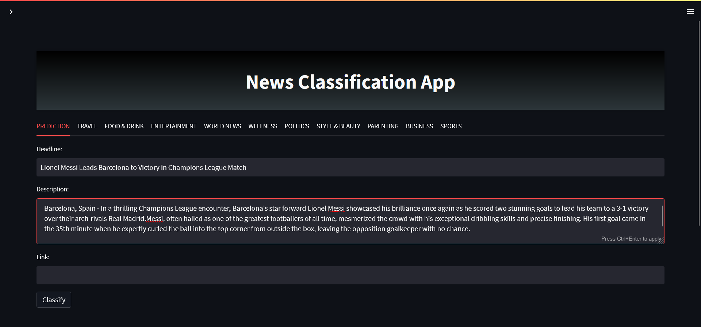
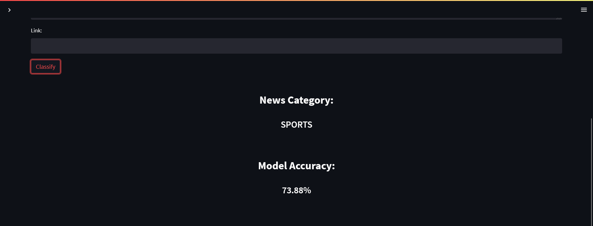
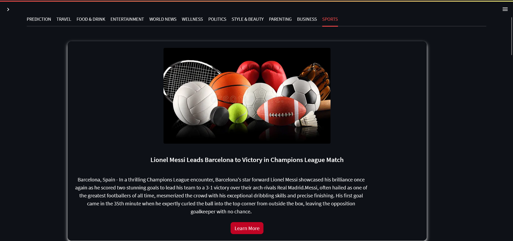
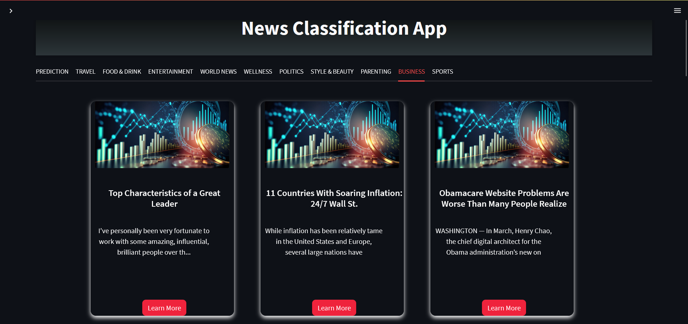

# NewsPalette: News Article Classification

**October 2024**

## Introduction

NewsPalette is a machine learning project designed to classify news articles into predefined categories using the Naive Bayes algorithm. Trained on a Kaggle dataset, this application helps organize news content based on user interests, offering an intuitive experience through a sleek Streamlit web interface.

## Features

* **Automated News Classification**: Predicts the category of a news article based on its headline (and optionally the description).
* **Interactive User Interface**: Built with Streamlit, enabling real-time input and instant predictions.
* **Categorized News Display**: Allows users to browse articles by category through tabbed sections.
* **Model Accuracy Display**: Shows the performance metrics of the model.
* **Custom Styling**: Integrates custom CSS for an enhanced UI/UX.

## News Categories

The model classifies articles into 10 categories:

* Wellness
* Politics
* Entertainment
* Travel
* Style & Beauty
* Parenting
* Food & Drink
* World News
* Business
* Sports

## Technologies Used

* **Programming Language**: Python
* **Machine Learning**: Scikit-learn (Naive Bayes, TF-IDF, metrics)
* **Data Handling**: Pandas
* **Web Framework**: Streamlit
* **Model Persistence**: Pickle
* **Development Environment**: VS Code / Jupyter Notebooks

## Dataset & Preprocessing

**Source**: `NewsCategorizer.csv` (Kaggle)

### Data Cleaning

* **Remove Nulls**: Ensured data integrity by dropping rows with missing values.
* **Remove Duplicates**: Eliminated redundant entries to prevent training bias.
* **Drop Irrelevant Columns**: Removed columns not relevant to classification (e.g., author, dates).

### Text Processing

* **Lowercasing**: Standardized text for uniform analysis.
* **Punctuation Removal**: Removed punctuation to reduce noise.
* **Digit Removal**: Removed non-informative numerical characters.
* **Stopwords Removal**: Filtered out common English stopwords.
* **Lemmatization**: Reduced words to their root forms for better generalization.

## Methodology

### TF-IDF Vectorization

* Converts text into numerical features.
* Highlights important words by considering their frequency across documents.
* Saved as `vector.pkl` for reuse.

### Naive Bayes Classification

* **Model**: Multinomial Naive Bayes
* **Why**: Efficient, accurate, and suitable for text classification.
* **Output**: Predicts one of the 10 categories.
* **Model File**: Saved as `model.pkl`

## Frontend Development (Streamlit)

Provides a web interface with the following capabilities:

* Accepts user input (headline, optional description/link).
* Sends input to the model for classification.
* Displays the result and accuracy.
* Shows categorized tabs with sample articles.

## Setup & Installation

1. **Clone or Download the Repository**

```bash
# Example:
git clone https://github.com/yourusername/NewsPalette.git
cd NewsPalette
```

2. **Create a Virtual Environment (Recommended)**

```bash
python -m venv venv
# On Windows
venv\Scripts\activate
# On macOS/Linux
source venv/bin/activate
```

3. **Install Dependencies**
   Create a `requirements.txt` file:

```txt
streamlit
pandas
scikit-learn
```

Then install:

```bash
pip install -r requirements.txt
```

4. **Verify Required Files are Present**
   Ensure the following files are in the root directory:

* `Home.py`
* `NewsCategorizer.csv`
* `model.pkl`
* `vector.pkl`

## Usage

To launch the application:

```bash
streamlit run Home.py
```

Open the link (typically [http://localhost:8501](http://localhost:8501)) in your browser.

## Image Gallery

### Main Interface



### Predicted Category Display



### News Under "Sports" Category



### News Under "Business" Category




> ⚠️ Ensure the image paths are correct relative to your README location. Use `./assets/Img-X.png` if images are in the `assets/` folder.

## Future Enhancements

* **Incorporate Description into Predictions**: Use both headline and description for richer context.
* **Dynamic Image Integration**: Display news-relevant images if URLs are available.
* **User Accounts & Preferences**: Enable login and personalized category tracking.
* **Detailed Evaluation Metrics**: Add precision, recall, F1-score, and confusion matrix for transparency.
* **Continuous Learning**: Automate model updates with new data.
* **REST API Support**: Make classification accessible via API endpoints.

---

Feel free to contribute, raise issues, or fork this project to extend its capabilities!
